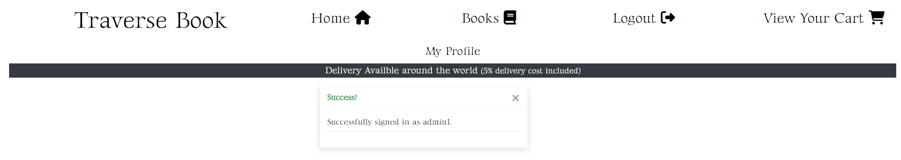
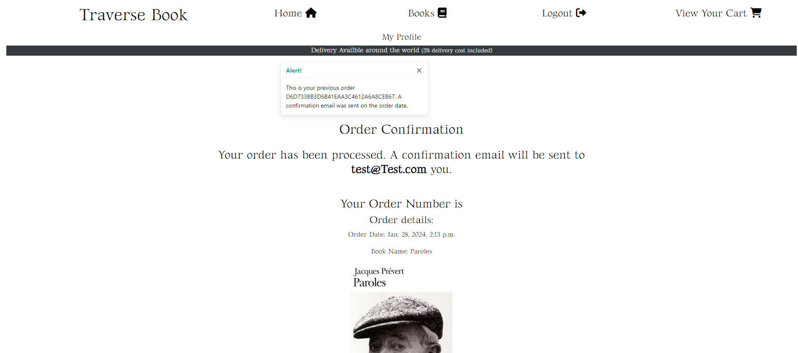
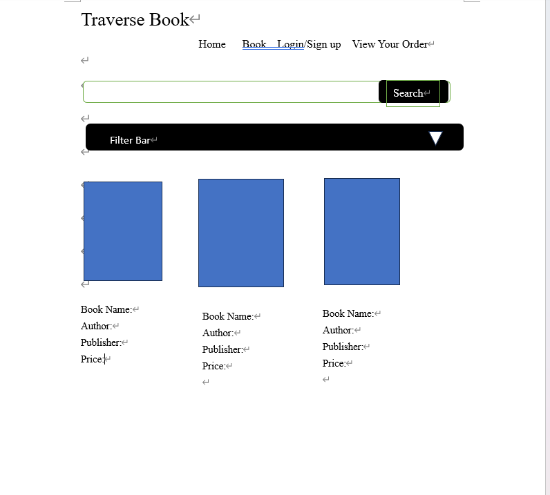

<h1>Traverse Book</h1>

<h2>Table of Contents</h2>

1. [Traverse Book](#traverse-book)
2. [Marketing Strategy](#marketing-strategy)
   - [Market Research](#market-research)
   - [Social Media and Promotion](#social-media-and-promotion)
   - [SEO and Keyword](#seo-and-keyword)
   - [Visual Design](#visual-design)
3. [Home Page](#home-page)
   - [Sign In Page Session](#sign-in-page-session)
   - [Sign Up Page Session](#sign-up-page-session)
   - [Navigation Bar At Home Page](#navigation-bar-at-home-page)
4. [Book and Book Detail Page](#book-and-book-detail-page)
   - [How to Make an Order](#how-to-make-an-order)
   - [How to View Cart](#how-to-view-cart)
   - [How to Check Out and Make Payment](#how-to-check-out-and-make-payment)
   - [How to Delete and Edit Order](#how-to-delete-and-edit-order)
5. [Profile Page](#profile-page)
6. [Development](#development)
   - [Original Flowchart And Wireframe](#original-flowchart-and-wireframe)
   - [Agile Approach in Development](#agile-approach-in-development)
   - [User Story](#user-story)
   - [Future Development Possibility](#future-development-possibility)
7. [Testing](#testing)
      - [Manual Testing](#manual-testing)
      - [Automated Testing](#automated-testing)
      - [HTML Validation](#html-validation)
      - [CSS Validation](#css-validation)
      - [Bugs](#bugs)
      - [Lighthouse Desktop](#lighthouse-desktop)
      - [Lighthouse Mobile](#lighthouse-mobile)
8. [Deployment](#deployment)
9. [Credit](#credit)

[Traverse Book](https://ci-project5-4ad812effe24.herokuapp.com/) is a full-stack project that enables user to make order and payment on books of different genres, languages, and cover.

<h2>Marketing Strategy</h2>

<h2>Market Research</h2>

Online bookshop belongs to a B2C business model which sells product directly to customer

<h3>Initial Idea</h3>

<li> The initial idea of this online bookshop comes from my personal experience as a multilingual reader living in UK. It is observable that not enough source of selling books of different languages available in English speaking countries. The title of the page “Traverse Book” wishes to represent the idea to traverse the language and cultural border and encompass more books from different languages, genre, and covers.</li>

<h3>Target Audience and markets</h3>

<li>Online bookshop is quite prevalent in the book market in anglophonic world, but it is not that common for online bookshop that sells books of different languages. In views of this developing market when more migration is happening from Asia to European countries. Traverse Book hopes to grasp the market gap of providing mulitlingual online book store to readers from different background. It will be the specification that differentiates Traverse Book from competitors. </li>

<h3>Features meeting audiences' expectations</h3>

<li>To achieve that, I have tried to input books of different languages apart from English such as Chinese, French, Japanese in order to make this available. There will be room for further development if there is more stock in my knowledge.</li>

<li>Traverse Book also serves similar to an indepenedent bookstore which is small in size but more flexible in choosing books and user-oriented by enabling customer to add their book interest and recommendation in the customer profile page which will enable user to advise on our stocks.</li>

<li>Therefore, the target audience of Traverse book includes general readers in Anglophonic world and the bilingual or multilingual foreign readers to provide unque, tailored and convenient book purchase experience.</li>

<h2>Social media and Promotion</h2>

<h3>Facebook page</h3>

<li>A facebook page has been mocked up with the product image as an icon for future promotion and the link to the page has been attached in the icon of the footer.</li>
<li>The facebook page acts as a medium to attract user to our website to view products and activity promotion.</li>

[Facebook page](https://www.facebook.com/people/Traverse-Book/61554559140023/)

<h3>Instagram: Reader instagram</h3>

<li>In view of the trend of bookstagram which means using Instagram account to share books, reviews and comment. I have mocked up an instagram account with a bilingual book review written as an experiment for future activity such as book club as a promotion.</li>

[Instagram page: Traverse Book](https://www.instagram.com/traverse.bookreader?igsh=MXR2dnF2ejB3aWM5bw==)

<h3>Subscription Newsletter</h3>

<li>A pop-up subscription form is also built using MailChimp to mock up a news letter subscription functionality to keep user updated for the new book in the shop.</li>

<li>Successful MailChimp subscription record (No email sent as it is a mock-up form)</li>

<h3>In-page promotion</h3>
<li>In the top nav bar, there is a statement promoting delivery available and it only counts 5% of the total price to let the user know before making any purchase.</li>

<li>Using the quote from George R.R. Martin, the author of A Song of Ice and Fire: "A reader lives a thousand lives before he dies and the one who doesn't read, lives just one." to promote the idea of reading is able to traverse our life experience, also echoing the title of the webpage Traverse Book.</li>

<h3>SEO and Keyword</h3>

<li>I have added the genre of books we offer in the HTML head element tag to enrich the SEO performance of my page. The logic behind is to capture the keyword when reader is looking for particular subject or genre of books</li>

<h3>Visual Design</h3>

<li>Color: I deliberately picked white background and black font color as minimalist style. </li>
<li>Font: The font Gideon Roman is picked as the font-family of most of the word in the page because it looks similar to Time New Roman in word and it is a traditional and classic style of font that looks like bookshop or bookish people will sync with.</li>

<h2>Home Page</h2>

<h3>The home page consists of three parts in structure: </h3>

<ol>

<li>the top navigation bar with four buttons: home, books, login/signup (logout when user is authenticated), and view your cart
. Also a My profile link and 5% delivery cost statement are displayed </li>
<li>underneath, there are a statement quote and background image for promotion, the start looking for book button is another link for user to click into the books page</li>
<li>The footer part includes social media icons and privacy policy</li>

</ol>

<h3>Home page overview</h3>

<h3>Sign In page Session</h3>

<h3>Sign Up page session</h3>

<h3>Sign Up Confirmation Email </h3>

(It is a forward email from my friend who helps to test this functionality, for privacy consideration, the email address is blackened.)

<h2>Navigation Bar At Home Page</h2>

<h2>Book and Book Detail Page </h2>

<li>In the books page, it includes a search bar for user to search the book name, author and isbn information, beneath is a sort bar enable user to sort books according to alphabetical ascending or descending order</li>
<li>User can click into the book title or book photo to view the book details in book detail pages.</li>

<h3>Books page overview</h3>

<h3>Book Detail page overview</h3>

<h3>Search Bar at Books page</h3>

<h3>Sort book by name or price in ascending or descending order at book page
</h3>

<h2>How to make an order</h2>

<li>User can navigate to the book page and make their order by clicking into the book_detail page. It will lead them to the details of the books such as authors, ISBN, publisher, page numbers. They can make their order by clicking the add to cart button in the book details page. </li> 

<li>After clicking the add to cart button, it will lead them to the order page which they can see the price of the book and the total price after adding the delivery cost which is 5% of the total price. There is also a button for them to proceed to checkout if they want. Otherwise, they can head back to the book page by clicking the button “Keep shopping".</li>

<h3>Add to cart button in book detail page</h3>

 
 
<h3>Order page, checkout button and keep shopping button</h3>

 

<h2>How to view Cart</h2>

<li>User can click on the "View Your Cart" button at the top right corner of the page to view and amend orders at navigation bar.</li>

<h3>View Your Cart button</h3>

<h2>How to check out and make payment</h2>
<li>User can check out by clicking the checkout button at the bottom of the order page.</li>
<li>It will lead the user to the checkout page where they can view their order sumary displayed at the top of the page and a form for them to input their full name, email, phone number and address date with the checkbox for them to tick if they want to save these information into their profile as to respect GDPR rules.</li>

 At the bottom of the page, there is a card payment field which enables them to type their card number, CVC code and the expiration date. As to remind the user of the amount they are going to pay in red. </li>
<li>After submitting the payment form, there will be an authentication screen pops out by the Stripe 3D authentication to ensure that the payment is authenticated by the user. If the user declines the payment, it will lead them back to the checkout page with the form filled</li>

<li>If the payment is successful, it will lead the user to the checkout_success page where they will see the confirmation of the payment and the order number generated at the top of the page, with the order summary displayed again. The billing information is also displayed such as the order total ,delivery cost, and overall total. They can also click continue shopping if they want to shop for more.</li>

<li>As stated in the successful purchase message and the page written, a confirmation is sent to the user after finishing purchase with the link to return back to the checkout_success page.</li>

<h3>Payment form</h3>

<h4>Order Summary</h4>

<h4>Contact and Delivery Information</h4>

<h4>Card Payment Details</h4>

<h3>Checkout authentication by Stripe</h3>

<h3>Checkout Success Page with the Order details rendered out</h3>

<h3>Checkout Success Page with the Billing and Delivery information printed out</h3>

<h3>Confirmation Email</h3>

<li>When clicking into the link, it will lead user back to their order.</li>

<h2>How to Delete and Edit Order</h2>
<li>User can delete order by clicking the remove button in each product in order page. After clicking it will remove the product and stay in the order page.</li>

<li>User can also choose to remove all products by clicking the remove all button.</li>
<li> User can also adjust the number of books they want by clicking the number bar to adjust, by clicking the submit button, it will update the number of books and price automatically.</li>

<h3>Adjust button and Remove button for each product in order page</h3>

<h2>Profile page</h2>

<li>The profile is only accessible by user who has account and logged in as clicking in the "My profile" link in the bottom of navigation bar.</li>
<li>User can also edit their profile and share their book interest after they have created an account.</li>
<li>After they have submitted the form. All the information will be saved and will be displayed whenever they are logged in for them to edit.</li>
<li>If the user has ordered  items previously, it will be listed as a table at the bottom of the page at the "Order History section".</li>
<li>When clicking into the order number, it will lead the user back to the checkout success page which they can view the order details.</li>
<li>At the bottom of profile page, there are two links to connect the user to Facebook page and Instagram page as well in order to encourage them to connect and share and promote the bookstore at the same time.</li>

<h3>My Profile in nav bar</h3>

<h3>Profile and Book Interest form</h3>

<h3>Order History Section</h3>

<li>When clicking into the order number, it can lead the user into that particular order.</li>

<h3>Promote Social media at the bottom</h3>

<h2>Development</h2>

<h2> Original Flowchart And Wireframe</h2>

<h3>Wireframe Home</h3>

Initially, the wireframe for home is inspired by the ocean-book-glass 
background image and the font Times New Roman, the setting of start Looking for 
books hopes to create a visual effect of attracting customer to click inside with
the white color font but it is a bit hard to be visible so changed to black text with
white background, with hover color-changing effect.

<h3>Wireframe Books</h3>

The book page wireframe have more modification because it is different for 
screen size in word document compare to actual code styling with bootstrap, but
the idea to have 2 to 3 books in a row has been set, the book cover is set to be 
with hyperlink into book details and only print out basic information in the book.html page
to avoid the information becoming too crowd.

Checkout app and Order app was added later during the coding process.

<li>In my original setting, I would like to offer user choices in filtering the books according to genre, covers, and, languages.</li>
<li>After doing more research and building the page, I realise that it would be too complicated so I simplified by only keeping the search bar.</li>
<li>I have also added a login and sign off function using django allauth functionality.</li>

<h2>Agile approach in development </h2>

<li>I have follow the agile approach in this project by setting up various issues to improve my project throughout the development process</li>

<h2>User Story</h2>

<table>
<thead>
    <tr>
    <th>User Story</th>
    <th>Type of User needed</th>
    <th>Features in the project</th>
    </tr>
</thead>
<tbody>
    <tr>
    <td>
    <h5>DIFFERENT LANGUAGES BOOK</h5>
    
As a multilingual reader, I want to be able to find books of different languages, so that I can fit my reading appetite.

    </td>
    <td>Multilingual reader</td>
    <td>Book page</td>
    </tr>
    <tr>
    <td>
    <h5>DISPLAY BOOK PUBLICATION INFORMATION</h5>
    
As a student, I want to be able to know about the book publication information, so that I can find the exact book and cite them when necessary.

    </td>
    <td>Student</td>
    <td>Book page</td>
    </tr>
    <tr>
    <td>
    <h5>BOOK DELIVERY</h5>
    
As a reader living oversea, I would like to order the book to be delivered, so that I can save time to order it separately.

    </td>
    <td>Reader Living Oversea</td>
    <td>Home Page, Order and Checkout Page mock up Delivery details and cost</td>
    </tr>
    <tr>
    <td>
    <h5>PRICE OF DELIVERY</h5>
    
As a reader living oversea, I am able to know about the price with delivery cost, so that I can pay without calculating it myself.

    </td>
    <td>Reader living oversea</td>
    <td>Order and Checkout Page shown 5% delivery cost</td>
    </tr>
    <tr>
    <td>
    <h5>SEARCH BOOKS</h5>
    
As a researcher, I am able to find books relating to my research field, so that I can save time to browse around.

    </td>
    <td>Research or Student</td>
    <td>Book page enable keyword search including book name and author</td>
    </tr>
    <tr>
    <td>
    <h5>SEE PRODUCT TOTAL PRICE</h5>
    
As a normal customer, I am able to see the total price before I pay, so that I can plan how I want to buy accordingly

    </td>
    <td>Normal Customer</td>
    <td>Order page and Checkout Page</td>
    </tr>
    <tr>
    <td>
    <h5>CANCEL PRODUCT</h5>
    
As a normal customer, I am able to cancel my order easily so that I can cancel any item I want.

    </td>
    <td>normal customer</td>
    <td>Remove button and Remove all button in order page</td>
    </tr>
    <tr>
    <td>
    <h5>EDIT CHOICE</h5>
    
As a normal customer, I am able to edit the number of my choice easily, 
    so that I can change my options when I find better books

    </td>
    <td>normal customer</td>
    <td>Edit button in order page</td>
    </tr>
    <tr>
    <td>
    <h5>ADD INTEREST IN PROFILE</h5>
    
As a reader who likes to share, I am able to create my book interest 
    so that I can receive emails of related books news

    </td>
    <td>Reader who likes to share</td>
    <td>Book Interest form in profile page</td>
    </tr>
    <tr>
    <td>
    <h5>EDIT PROFILE</h5>
    
As a user, I am able to edit my profile stored so that I can keep my 
    information up to date

    </td>
    <td>User</td>
    <td>Profile page which enable user to update and save their information</td>
    </tr>
    <tr>
    <td>
    <h5>SORT PRODUCT</h5>
    
As a normal customer, I am able to sort the product by price to have a 
    plan in my budget.

    </td>
    <td>normal customer</td>
    <td>Sort bar in book page with price as an order</td>
    </tr>
    <tr>
    <td>
    <h5>PAYMENT CONFIRMATION EMAIL</h5>
    
As a normal customer, I am able to receive confirmation email after 
    payment. So that I can ensure the payment is successful.

    </td>
    <td>normal customer</td>
    <td>
Email will be sent after checkout page

    
    </td>
    </tr>
</tbody>
</table>

<h2>Future Development Possibility</h2>

<li>Adding Description in Book detail page to let customer read a summary of the book</li>
<li>Add News and Activity in Nav bar to store activities such as Book club</li>
<li>Development Function to Filter books based on genre and language</li>

<h2>Testing</h2>
<li>I tested that this page works in different browser such as: Chrome, Microsoft-edge, Firefox.</li>
<li>I confirmed the project is responsive, look goods and function on all standard size screen using devtool device tool bar.</li>

<h2>Manual Testing</h2>

<li>User Story</li>
<table>
<thead>
    <tr>
    <th>User Story</th>
    <th>Type of User needed</th>
    <th>Features in the project</th>
    </tr>
</thead>
<tbody>
    <tr>
    <td>
    <h5>DIFFERENT LANGUAGES BOOK</h5>
    
As a multilingual reader, I want to be able to find books of different languages, so that I can fit my reading appetite.

    </td>
    <td>Multilingual reader</td>
    <td>Book page</td>
    </tr>
    <tr>
    <td>
    <h5>DISPLAY BOOK PUBLICATION INFORMATION</h5>
    
As a student, I want to be able to know about the book publication information, so that I can find the exact book and cite them when necessary.

    </td>
    <td>Student</td>
    <td>Book page</td>
    </tr>
    <tr>
    <td>
    <h5>BOOK DELIVERY</h5>
    
As a reader living oversea, I would like to order the book to be delivered, so that I can save time to order it separately.

    </td>
    <td>Reader Living Oversea</td>
    <td>Home Page, Order and Checkout Page mock up Delivery details and cost</td>
    </tr>
    <tr>
    <td>
    <h5>PRICE OF DELIVERY</h5>
    
As a reader living oversea, I am able to know about the price with delivery cost, so that I can pay without calculating it myself.

    </td>
    <td>Reader living oversea</td>
    <td>Order and Checkout Page shown 5% delivery cost
    </td>
    </tr>
    <tr>
    <td>
    <h5>SEARCH BOOKS</h5>
    
As a researcher, I am able to find books relating to my research field, so that I can save time to browse around.

    </td>
    <td>Research or Student</td>
    <td>Book page enable keyword search including book name and author</td>
    </tr>
    <tr>
    <td>
    <h5>SEE PRODUCT TOTAL PRICE</h5>
    
As a normal customer, I am able to see the total price before I pay, so that I can plan how I want to buy accordingly

    </td>
    <td>Normal Customer</td>
    <td>Order page and Checkout Page</td>
    </tr>
    <tr>
    <td>
    <h5>CANCEL PRODUCT</h5>
    
As a normal customer, I am able to cancel my order easily so that I can cancel any item I want.

    </td>
    <td>normal customer</td>
    <td>Remove button and Remove all button in order page</td>
    </tr>
    <tr>
    <td>
    <h5>EDIT CHOICE</h5>
    
As a normal customer, I am able to edit the number of my choice easily, 
    so that I can change my options when I find better books

    </td>
    <td>normal customer</td>
    <td>Edit button in order page</td>
    </tr>
    <tr>
    <td>
    <h5>ADD INTEREST IN PROFILE</h5>
    
As a reader who likes to share, I am able to create my book interest 
    so that I can receive emails of related books news

    </td>
    <td>Reader who likes to share</td>
    <td>Book Interest form in profile page</td>
    </tr>
    <tr>
    <td>
    <h5>EDIT PROFILE</h5>
    
As a user, I am able to edit my profile stored so that I can keep my 
    information up to date

    </td>
    <td>User</td>
    <td>Profile page which enable user to update and save their information</td>
    </tr>
    <tr>
    <td>
    <h5>SORT PRODUCT</h5>
    
As a normal customer, I am able to sort the product by price to have a 
    plan in my budget.

    </td>
    <td>normal customer</td>
    <td>Sort bar in book page with price as an order</td>
    </tr>
    <tr>
    <td>
    <h5>PAYMENT CONFIRMATION EMAIL</h5>
    
As a normal customer, I am able to receive confirmation email after 
    payment. So that I can ensure the payment is successful.

    </td>
    <td>normal customer</td>
    <td>
Email will be sent after checkout page

    
    </td>
    </tr>
</tbody>
</table>

<li>Other functionality testing</li>
<table>
    <thead>
    <tr>
    <th>Functionality</th>
    <th>Result</th>
    </tr>
    </thead>
    <tr>
    <td>Sending register email</td>
    <td>Available (Please see the signup page session for the email)</td>
    </tr>
    <tr>
    <td>Sending Email regardless of user has profile or not</td>
    <td>Available (Please see the checkout session)</td>
    </tr>
    <tr>
    <td>User able to view order history from profile</td>
    <td>Available (Please see the order history session)</td>
    </tr>
</table>

<h2>Automated Testing</h2>

<h3>Covered app:</h3>
<li>Product app: models.py</li>
<li>Product app: views.py</li>
<li>Home app: views.py</li>
<li>Customer app: forms.py</li>
<li>Customer app: models.py</li>
<li>Customer app: views.py</li>
<li>Checkout app: forms.py</li>
<li>Checkout app: models.py</li>

<h2>HTML Validation</h2>

<li>No Error reported from https://validator.w3.org/nu/</li>

<h2>CSS Validation</h2>
<li>No Error reported from https://validator.w3.org/nu/</li>

<h2>Bugs</h2>

<h3>Solving bugs</h3>

<li>When I tried to build the stripe authentication. I realise that it is not working and the payment is not submitted successfully. Upon checking, I realise the id I have in the stripe_element.js does not match the one I have in the checkout.html. After uniting it, I can see the screen popped out with a valid card inputted.</li>

<li>When I am building the order.html, I cannot render the order to the template. After checking with mentor, I realise the problem is in the context because I previously added the order model in the Order app which confused the Django with the context tag “order” which I used to render the order in order.html. Therefore, I changed the context tag to item and moved the order model to checkout app, it has become available since then.</li>

<li>When I am debugging the error of remove and adjust order view, I realise the issue is because of the item_id is different in data type in the context, so I unify it by adding a str(item_id). Thanks for tutor's help in troubleshooting.</li>

<li>Another bug when I am debugging remove order view is when there is only one book left in the bag, and it is impossible to remove book, because when the remove button is clicked, the add order view is triggered unintentionally. After a couple round of testing, I find out it is because I used the return redirect but not return redirect (reverse('order')) in my add order views. It is thereby solved </li>

Lighthouse Desktop

Lighthouse Mobile

<h2>Deployment</h2>

The page is deployed using heroku, following the below steps:

<li> Install the heroku CLI in IDE terminal</li>
<li>Install Project requirements app </li>
<li>Create the heroku app</li>
<li>Create a database in ElephantSQL</li>
<li>Connecting our Remote Database</li>
<li>Pushing changes to Github</li>
<li>Fix ALLOWED_HOSTS and Run the Project</li>
<li>Connecting Heroku to Github</li>
<li>Set The SECRET_KEY in setting.py</li>
<li>Once the link is deployed, the link is generated</li>

The link is below https://ci-project5-4ad812effe24.herokuapp.com/

<h2>Credit</h2>

<h3>Code</h3>

<li>Model structure has been advised by my mentor Juliia Konovalov. Many Thanks for his patient and helpful guidance.</li>

<li> adjusting and deleting order, checkout app, stripe payment and templates, filter and searching, payment structure, profile, and order history page are inspired by tutorial of Boutique Ado project in Code Institute course.

[Boutique_Ado_Github]( https://github.com/Code-Institute-Solutions/boutique_ado_v1/tree/250e2c2b8e43cccb56b4721cd8a8bd4de6686546)
</li>

<li>testing format has been inspired by handout of Hello Django project in Code Institute modules

[Hello Django: Part 8: Testing](https://docs.google.com/document/d/1L7zyIXL1wCki2eOoDZPCw9fIIe93NfdCiA_mbht9P8A/edit#heading=h.hvy9tw74f1o0)

</li>

<li>Newsletter popup form from MailChimp

[MailChimp](https://mailchimp.com/landers/email-marketing-platform/?ds_c=DEPT_AOC_Google_Search_UK_EN_Brand_Acquire_Exact_MKAG_UK&ds_kids=p77184324956&ds_a_lid=kwd-2285511033&ds_cid=71700000112280664&ds_agid=58700008474313140&gad_source=1&gclid=EAIaIQobChMIqqah3vyEhAMVlJJQBh0TsgTuEAAYASAAEgLmNvD_BwE&gclsrc=aw.ds&currency=GBP)

</li>sitemap.xml from xml-sitemaps

[xml-sitemaps](https://www.xml-sitemaps.com/)

<li>Privacy policy from Privacy Policy Generator

[Privacy Policy Generator](https://www.privacypolicygenerator.info/)

</li>

<h3>Media</h3>

<h4>Index.html</h4>

https://pxhere.com/en/photo/105434/

https://toistudent.timesofindia.indiatimes.com/news/bookmark/a-reader-lives-a-thousand-lives/5748.html#:~:text=%22A%20reader%20lives%20a%20thousand,kept%20close%20to%20my%20heart.

<h4>book.html</h4>

https://www.amazon.co.uk/Runaway-Vintage-International-Alice-Munro/dp/1400077915

https://www.amazon.co.uk/Poetics-Penguin-Classics-Aristotle-ebook/dp/B002RI92L6

https://www.amazon.co.uk/Communist-Manifesto-introduction-Varoufakis-Classics/dp/1784873691

https://www.ebay.co.uk/itm/394132027496

https://www.amazon.co.uk/Hamlet-Publisher-Yale-University-Press/dp/B004R97PB2

https://www.amazon.co.uk/%E5%80%A6%E6%80%A0%E7%A4%BE%E6%9C%83-Traditional-Chinese-%E9%9F%93%E7%82%B3%E5%93%B2-ebook/dp/B081GY35YC

https://www.abebooks.co.uk/book-search/author/w-h-d-adams/

https://www.amazon.co.uk/Photography-Penguin-Modern-Classics-ebook/dp/B00P1SOF70

https://www-origin.abebooks.com/servlet/BookDetailsPL?bi=30826078551&searchurl=rr%3Don%26fe%3Don%26ds%3D10%26sortby%3D17%26isbn%3D9780394743646&cm_sp=msrp-_-msrpdesc-_-bdp

https://www.abebooks.co.uk/9781852244132/New-Collected-Poems-Winner-2011-1852244135/plp

https://www.ebay.co.uk/p/90344570

https://www.amazon.co.uk/Story-Art-Pocket-Gombrich-2006-10-07/dp/B00CF5WARY

https://www.amazon.co.uk/Histoire-beaut%C3%A9-Umberto-Eco/dp/2081243288

https://www.amazon.co.uk/Less-Than-One-Selected-Twentieth/dp/0141180110

https://www.amazon.co.uk/Time-Mother-Ocean-Vuong/dp/1787333841

https://www.ebay.co.uk/itm/304671395331

https://www.amazon.co.uk/Mirror-Dance-Catriona-McPherson/dp/152933795X

https://www.amazon.co.uk/King-Lear-Arden-Shakespeare-William/dp/1903436591

https://www.amazon.co.uk/Gender-Trouble-Routledge-Classics-Judith/dp/0415389550
 

https://www.amazon.co.uk/Gaga-Feminism-Gender-Normal-Action/dp/0807010979

https://www.amazon.co.uk/Dracula-Macmillan-Collectors-Library-Stoker/dp/1909621625

https://www.amazon.co.uk/Left-Hand-Darkness-S-F-MASTERWORKS-ebook/dp/B01NCU4VNT

https://www.amazon.co.uk/Illustrated-Brief-History-Time/dp/0593077180

https://www.amazon.co.uk/Never-Let-Me-Kazuo-Ishiguro/dp/0571258093

